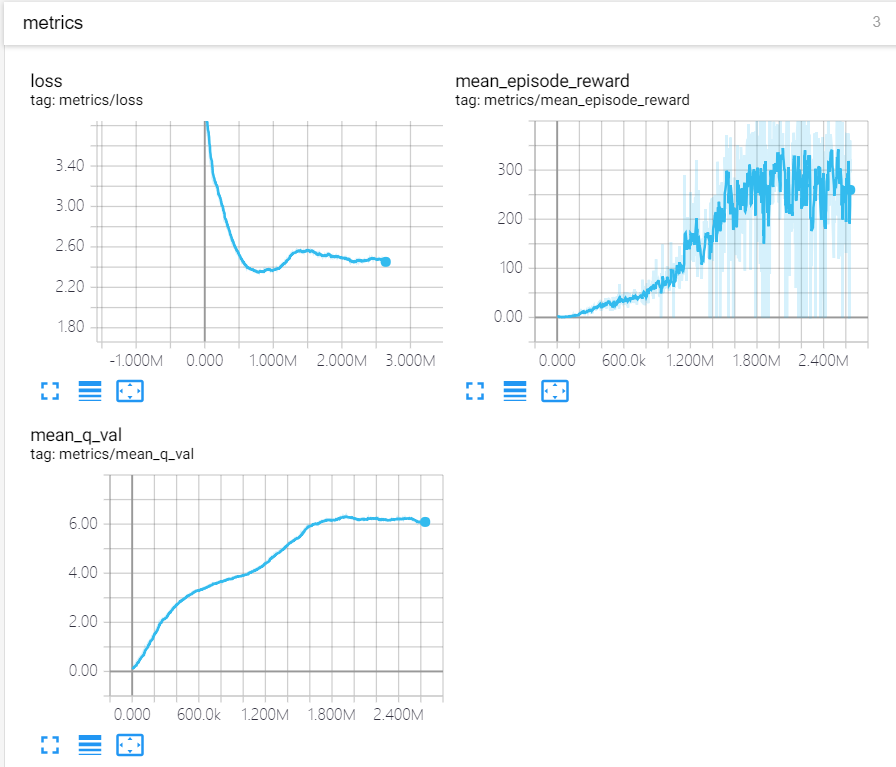

# Description
This project implement some reinforcement learning algorithms, including DQN, Double DQN, C51, etc. It contains subset of algorithms from [dopamine](https://github.com/google/dopamine). Compared with dopamine, it is more easier to understand by sacrificing some modularity and encapsulation. Therefore, it is more suitable for study.

# Requirement
- python == 3.6, other version may work as well.
- tensorflow >= 1.6.0
- [retro](https://github.com/openai/retro), video game emulator for RL.
- ffmpeg (optional), for record video.

# Result
Using C51, After training 48 hour on my GTX 960M.


# Tensorboard


# Usage
``` bash
# train the model
python train.py

# record actions
# python eval.py --record_dir <path to store record file>
python eval.py --record_dir record

# make video. Need to have ffmpeg in the path.
# python -m retro.scripts.playback_movie <record file>...
python -m retro.scripts.playback_movie .\record\Breakout-Atari2600-Start-000000.bk2


```

# Note
- Using a memory pool with 100 million elements will consume about 7 GB memory.
- C51 has faster convergence speed.

# TODO
- Implement store and restore for memory pool. 
- Add more algorithms.


# Reference Project
- [dopamine](https://github.com/google/dopamine), a research framework for fast prototyping of reinforcement learning algorithms.
- [baseline](https://github.com/openai/baselines), OpenAI Baselines: high-quality implementations of reinforcement learning algorithms.
- [DQN-tensorflow](https://github.com/devsisters/DQN-tensorflow), Tensorflow implementation of Human-Level Control through Deep Reinforcement Learning.